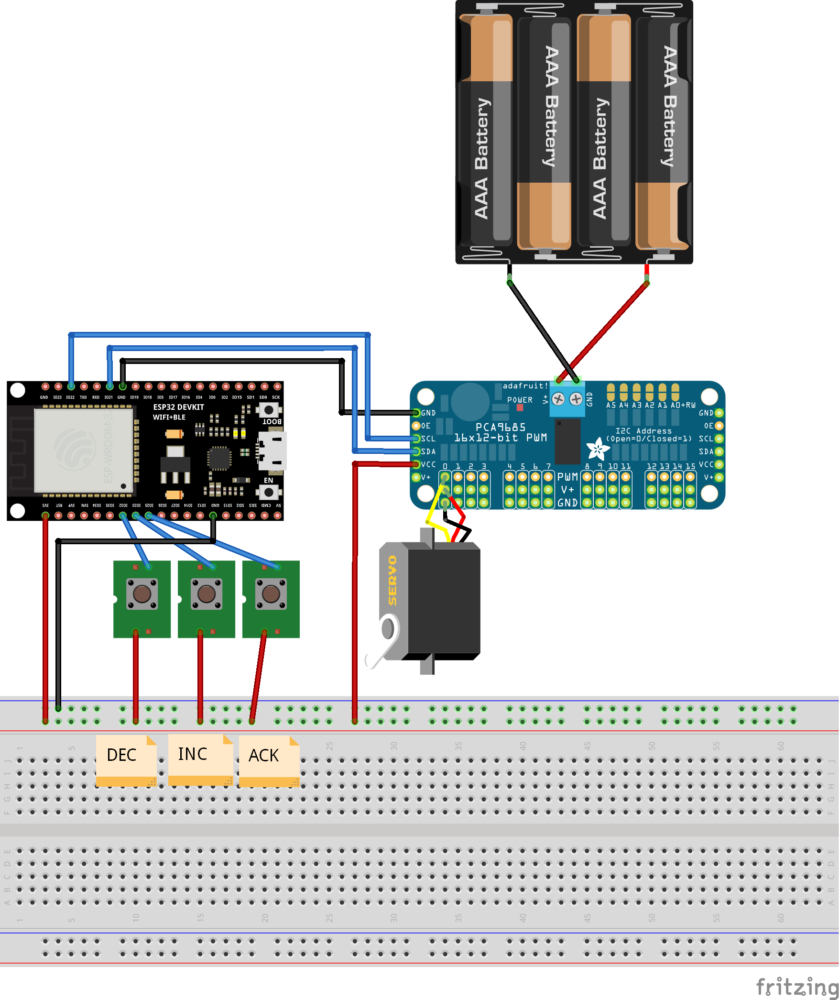

<h1 align=center>Adjust servo</h1>

This sketch helps you with:

-   Finding the shortes/longes PWM pulse length (PWM ticks) of a Servo
-   Putting the servo arm into the "middle" of the servos rotation range

## Usage

Follow Instructions on the Serial Monitor:

1. Find the shortes PWM pulse length
2. Find the longest PWM pulse length
3. Adjust 0˚ position
4. Find 90˚ position

### Button Controls

-   DEC: Decrease PWM pulse length
-   INC: Increase PWM pulse length
-   DEC + INC: Toggle step size between 1 and 10
-   OK: Acknowledge

## Parts

### PCA9685 servo driver:

-   12 bit PWM
-   4096 (2^12) PWM ticks

### MG 996R servo:

-   50 Hz
-   20ms (1s / 50Hz) PWM Period
-   1-2ms Duty Cycle

|                               | -90˚ | 0˚    | 90˚ |
| ----------------------------- | ---- | ----- | --- |
| Duty Cycle / PWM pulse length | 1ms  | 1.5ms | 2ms |
| PWM Ticks (out of 4096)       | 204  | 307   | 409 |

## Wiring

